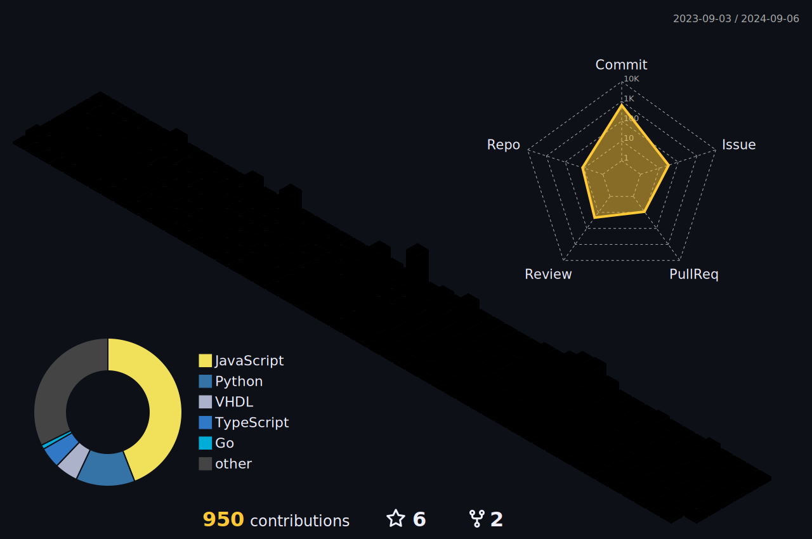

<h1 align="center">Hello guys Today we have a list of ...</h1>
<h6 align="center">If you send a friend request, please let me know your Discord username. I think I have too many scam friend requests :/</h6>
<br>
<div align="center">
  <a href="https://discords.com/bio/p/atomic09" target="_blank" rel="noreferrer">
    
  </a>
  <a href="https://wakatime.com/@018d9e20-7204-40cc-9d2f-4231bc99a8de" target="_blank" rel="noreferrer">
    
  </a>
  <a href="https://www.youtube.com/channel/UC3FvuPtV_Ry46j5m-I2zcjg?sub_confirmation=1" target="_blank" rel="noreferrer">
    
  </a>
</div>

###
👋 Hi! My name is **Atom** (aka. Atomic)<br><br>
💻 I’m currently working on **[?](https://github.com/ATOMIC09?tab=repositories)**<br><br>
🌱 I’m currently learning **?**<br><br>
📫 Email **phutawanchanrueng@gmail.com**<br><br>
🤣 Fun fact [**Meme maker?**](https://youtu.be/QqjGi20qmVQ)<br><br>
🗣️ Quote [**อ ย่ า ก ด น ะ**](https://ooooooooooooooooooooooo.ooo/ooooοооoοᴏοoοᴏοoοᴏooοᴏoᴏoᴏооoоᴏᴏoоᴏᴏοᴏоοοоᴏᴏοᴏοοοᴏοoοᴏοοoоᴏоοоoоοоοοoоᴏᴏοоοoοοoοοᴏοᴏoᴏοoοᴏοᴏoᴏоοοοοᴏοоοᴏοοоoοоoᴏοοoο)<br><br>
😉 This is [**not** a rick roll](https://youtu.be/-g03jC71GBw?si=BIpmuTHtRgAJNmkh)<br><br>
🖼️ Profile credit is [here](https://www.miyoushe.com/ys/article/47924217)

<details open>
<summary><h1 align="center">Stack & Statistic</h1></summary>
<div align="center">
  <h6 align="center">แค่แตะนี่นับมั้ยอะ🤔</h6>
  <a href="https://www.python.org" target="_blank" rel="noreferrer"> 
     </a> 
  <a href="https://www.cprogramming.com/" target="_blank" rel="noreferrer"> 
     </a> 
  <a href="https://www.w3schools.com/css/" target="_blank" rel="noreferrer"> 
     </a> 
  <a href="https://www.w3.org/html/" target="_blank" rel="noreferrer"> 
     </a> 
  <a href="https://developer.mozilla.org/en-US/docs/Web/JavaScript" target="_blank" rel="noreferrer"> 
     </a>
  <a href="https://www.typescriptlang.org/" target="_blank" rel="noreferrer"> 
     </a> 
  <a href="https://reactjs.org/" target="_blank" rel="noreferrer">
    </a>
  <a href="https://nextjs.org/docs" target="_blank" rel="noreferrer">
    </a>
<!--   <a href="https://vuejs.org/" target="_blank" rel="noreferrer">
    </a> -->
  <a href="https://tailwindcss.com/" target="_blank" rel="noreferrer"> 
     </a> 
  <a href="https://mui.com/" target="_blank" rel="noreferrer">
    </a>
  <a href="https://nodejs.org/en/" target="_blank" rel="noreferrer">
    </a>
  <a href="https://expressjs.com/" target="_blank" rel="noreferrer">
    </a>
<!--   <a href="https://www.mysql.com/" target="_blank" rel="noreferrer">
    </a> -->
  <br>
  <a href="https://azure.microsoft.com/en-in/" target="_blank" rel="noreferrer"> 
     </a> 
  <a href="https://firebase.google.com/" target="_blank" rel="noreferrer"> 
     </a> 
  <a href="https://cloud.google.com/" target="_blank" rel="noreferrer">
    </a>
  <a href="https://heroku.com" target="_blank" rel="noreferrer"> 
     </a>  
  <a href="https://render.com/" target="_blank" rel="noreferrer">
    </a>
  <a href="https://www.docker.com/" target="_blank" rel="noreferrer">
    </a>
  <a href="https://www.linux.org/" target="_blank" rel="noreferrer"> 
     </a> 
  <a href="https://git-scm.com/" target="_blank" rel="noreferrer">
    </a>
  <a href="https://www.arduino.cc/" target"_blank" rel="noreferrer">
     </a>
<!--   <a href="https://opencv.org/" target="_blank" rel="noreferrer"> 
     </a> -->
<!--   <a href="https://grafana.com" target="_blank" rel="noreferrer"> 
     </a>    -->
  <a href="https://www.blender.org/" target="_blank" rel="noreferrer">
    </a>
  <a href="https://code.visualstudio.com" target="_blank" rel="noreferrer"> 
     </a>
<!--   <a href="https://slack.com" target="_blank" rel="noreferrer"> 
     </a>
  <a href="https://www.adobe.com/uk/products/photoshop.html" target="_blank" rel="noreferrer">
    </a>
  <a href="https://www.adobe.com/uk/products/premiere.html" target="_blank" rel="noreferrer">
    </a> -->
  <a href="https://www.figma.com/" target="_blank" rel="noreferrer">
    </a>
  <a href="https://unrealengine.com/" target="_blank" rel="noreferrer"> 
     </a> 
    
  
</div>
<br>

<div align="center">
  
  
  
  
</div>

<div align="center">
  
</div>
</details>

<details>
<summary><h1 align="center">Other</h1></summary>
<div align="center">
  <a href="https://youtu.be/thybJjixXw0">
    
  </a>
  <br/>
  <br/>
  <p>"ผู้ใช้ iPad Pro ปี 2020 กำลังร่ำไห้"</p>
</div>
</details>

<br>
<div align="center">
  <div>
    <h1 align="center">
      
      WakaTime Statistics
    </h1>
  </div>
  <div align="center">
  <!--START_SECTION:waka-->

```rust
From: 11 February 2024 - To: 22 November 2024

Total Time: 277 hrs 46 mins

TypeScript        99 hrs 30 mins  ⣿⣿⣿⣿⣿⣿⣿⣿⣿⣀⣀⣀⣀⣀⣀⣀⣀⣀⣀⣀⣀⣀⣀⣀⣀   35.83 %
JavaScript        45 hrs 20 mins  ⣿⣿⣿⣿⣀⣀⣀⣀⣀⣀⣀⣀⣀⣀⣀⣀⣀⣀⣀⣀⣀⣀⣀⣀⣀   16.32 %
C                 42 hrs 6 mins   ⣿⣿⣿⣷⣀⣀⣀⣀⣀⣀⣀⣀⣀⣀⣀⣀⣀⣀⣀⣀⣀⣀⣀⣀⣀   15.16 %
VHDL              29 hrs 44 mins  ⣿⣿⣶⣀⣀⣀⣀⣀⣀⣀⣀⣀⣀⣀⣀⣀⣀⣀⣀⣀⣀⣀⣀⣀⣀   10.71 %
Python            23 hrs 30 mins  ⣿⣿⣄⣀⣀⣀⣀⣀⣀⣀⣀⣀⣀⣀⣀⣀⣀⣀⣀⣀⣀⣀⣀⣀⣀   08.46 %
Bash              8 hrs 48 mins   ⣷⣀⣀⣀⣀⣀⣀⣀⣀⣀⣀⣀⣀⣀⣀⣀⣀⣀⣀⣀⣀⣀⣀⣀⣀   03.17 %
GDScript3         7 hrs 2 mins    ⣶⣀⣀⣀⣀⣀⣀⣀⣀⣀⣀⣀⣀⣀⣀⣀⣀⣀⣀⣀⣀⣀⣀⣀⣀   02.53 %
HTML              4 hrs 5 mins    ⣤⣀⣀⣀⣀⣀⣀⣀⣀⣀⣀⣀⣀⣀⣀⣀⣀⣀⣀⣀⣀⣀⣀⣀⣀   01.47 %
JSON              3 hrs 9 mins    ⣤⣀⣀⣀⣀⣀⣀⣀⣀⣀⣀⣀⣀⣀⣀⣀⣀⣀⣀⣀⣀⣀⣀⣀⣀   01.14 %
Text              3 hrs 4 mins    ⣤⣀⣀⣀⣀⣀⣀⣀⣀⣀⣀⣀⣀⣀⣀⣀⣀⣀⣀⣀⣀⣀⣀⣀⣀   01.11 %
```

<!--END_SECTION:waka-->
  </div>
</div>
<br>
<div align="center">
    
    
    <br>
    
    <h6 align="center">ต้องมีสักอันที่ถูกแหละนะ</h6>
    
    <h6 align="center">ว่าแต่ใครทำอะไรจน 2 ล้านวิววะนั่น🗿</h6>
</div>


